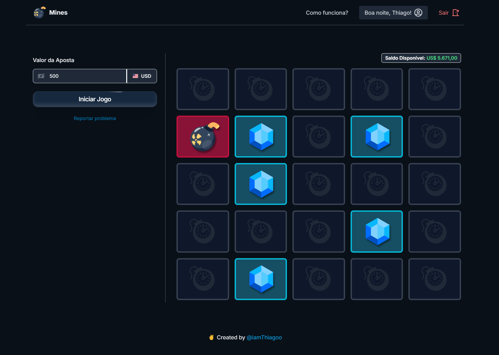

# Mines - Cassino

This repository contains my version of the **Mines** game inspired by the gambling versions from some casinos.

## Preview's
<div style="display: flex; gap: 10px;">


</div>

## 🎮 About the Game
In Mines, players choose cells in a grid to avoid hidden mines and earn multipliers. Each safe cell increases potential winnings, but the risk of hitting a mine grows as well.  

This project was created to explore and recreate the dynamics and strategy of a modern casino game. If you decide to try it, don't expect to win money in the end, okay? ... I wish too 😅

---

## 🚀 Tech Stack
- NestJS (Jest)
- NextJS (Shadcn Ui)
- MongoDB
- Docker
- Websocket

---

## ▶️ Running the Application
1. Make sure you have Docker and Docker Compose installed on your machine.
2. Run all applications with the command:
    ```bash
    docker-compose up -d
    ```
3. This command will start all the necessary containers to run the entire project

---

## 📊 ODD's Strategy
The strategy used to define the odds follows the standard model/multiplier of Stake (a betting platform used as reference). Each number of hits corresponds to a reward multiplier. 

| Acertos | Odd        | Acertos | Odd        |  
|:------|:------|:------:|------:|    
| 0       | 1.00x      | 12      | 7.96x      | 
| 1       | 1.13x      | 13      | 10.35x     |     
| 2       | 1.29x      | 14      | 13.80x     | 
| 3       | 1.48x      | 15      | 18.97x     | 
| 4       | 1.71x      | 16      | 27.11x     |
| 5       | 2.00x      | 17      | 40.66x     |  
| 6       | 2.35x      | 18      | 65.06x     |     
| 7       | 2.79x      | 19      | 113.85x    | 
| 8       | 3.35x      | 20      | 227.7x     |   
| 9       | 4.07x      | 21      | 569.3x     | 
| 10      | 5.00x      | 22      | 2277x      |  
| 11      | 6.26x      |

## 📜 License
- [MIT](LICENSE)